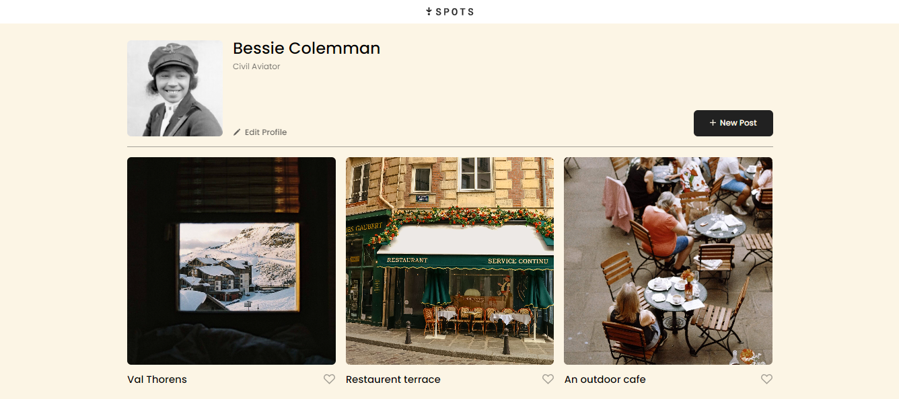
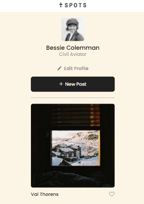

# Project 3: Spots

The Spots is third project of the software engineering program, which old and new technology were used to create this project. The main functionality of this project is for the user to share their favorite pictures with the world.

## Tech Stack

- HTML -
  Used to build the structure of the Webpage.
- CSS -
  Used to style the webpage.
- JavaScript -
  Used to make website more interactive.
- DOM -
  Used manipulate, access, and modify documents.
- Responsive design -
  Used to change and adapt for certain resolutions.
- Media queries -
  Used to specify when to change and adapt.
- Grids -
  Used to position the images in a certain order when the screens changes resolution.
- Figma -
  Used figma to get the all information we need to create website.

## Images

- Desktop View
  
- Mobile View
  

## Video

- [Video Link](https://drive.google.com/file/d/1VRlU3AXVviHgnLy8YwwConuk-aN7ZCOd/view?usp=sharing)

## Deployment

- [Github Link](https://mdhamdan-13.github.io/se_project_spots/)
